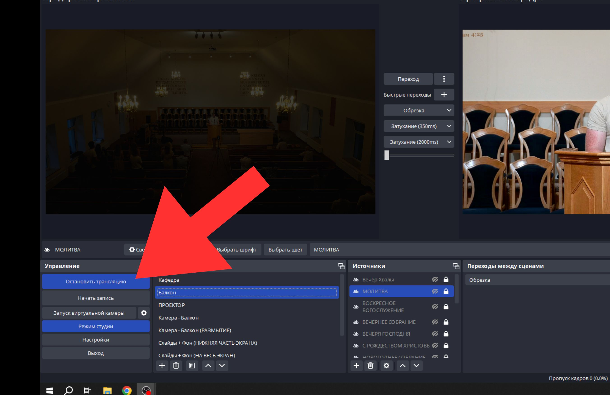

## Запуск Прямого Эфира

**1 Шаг. Нажать на иконку камеры в правом верхнем углу!** 

**2 Шаг. Выбрать из меню "Начать трансляцию"!** 

**3 Шаг. В меню выбрать "Запланировать трансляцию"!** 

**4 Шаг. Использовать предыдущие настройки в зависимости от собрания. На воскресное собрание следует использовать заготовку "ВОСКРЕСНОЕ БОГОСЛУЖЕНИЕ"!** 

**5 Шаг. Утвердить выбранные настройки кнопкой "Предыдущие настройки"!** 

**6 Шаг. Изменить значок трансляции на соответсвующий теме/дате!** 

**7 Шаг. Изменить название собрания!** 

Название собрания должно быть в формате: 
- Для воскресного собрания: 

"Тема/место основной проповеди" 
| Воскресное богослужение"
- Для собрания в пятницу: 
"Библейский час: Место писания | Призыв к молитве: "Тема призыва"
- Для **Хвалебного** собрания в пятницу:
Вечер Хвалы и Славословия | 
"Дата Собрания"

**8 Шаг. Следует выбрать открытый доступ и указать время начала собрания! Утвердить кнопкой "готово"!** 

**9 Шаг. Перейти в программу OBS Studio, выбрать подходящий план и запустить трансляцию!** 

**10 Шаг. Чтобы выйти в эфир и у зрителя появилась картинка, запустить трансляцию уже в YouTube Studio кнопкой "Начать Эфир"!** 

## Завершение Прямого Эфира 

**1 Шаг. При завершении трансляции, завершить сначала в YouTube Studio** 

**2 Шаг. После завершения трансляции в YouTube Studio, завершить трансляцию в OBS Studio!** 

## Важно!

**Сохранить Трансляцию!** 
**Заполнить описание и таймкоды, смотреть заготовки для заполнения!** 